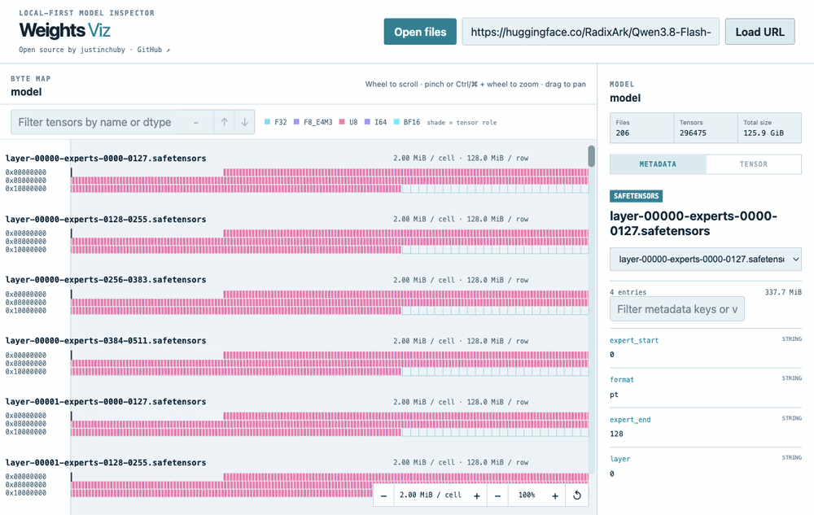
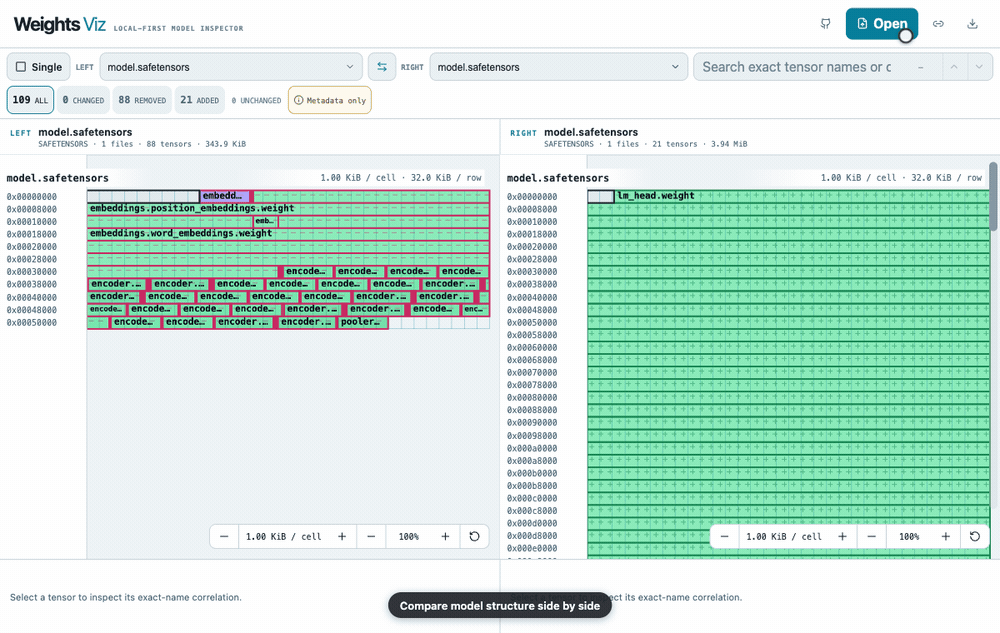

# Weights Viz

A local-first byte map for model weights. Open a GGUF, SafeTensors, or ONNX
model and explore its files, tensors, data types, shapes, byte ranges, and
sampled values without loading the whole model into memory.

**Live app:** https://www.justinchuby.com/weights-viz/

**VS Code extension:** [Install from Visual Studio Marketplace](https://marketplace.visualstudio.com/items?itemName=justinchuby.weights-viz)



The project ships the same React visualization in two hosts:

- An installable Progressive Web App with drag-and-drop, multi-file selection,
  URL input, offline local-file support, and side-by-side comparison.
- A VS Code custom editor and dedicated model comparer.

## Supported formats

| Format | Layout and metadata | Values | Multi-file / external data |
| --- | --- | --- | --- |
| SafeTensors | All official dtypes, including packed F4/F6, plus header metadata, shape, and exact ranges | On-demand samples and statistics for scalar dtypes | `*.safetensors.index.json` automatically joins shards |
| GGUF v2/v3 | All current GGML tensor type IDs and block sizes, KV metadata, alignment, and exact ranges | On-demand samples for scalar and supported common quantized dtypes | Standard `model-00001-of-000NN.gguf` shards are grouped as one model |
| ONNX | All current `TensorProto.DataType` values through `INT2`, initializer shape, and exact external-data ranges | Metadata only | Referenced `.data` address spaces are inferred from the manifest; the data files are not required |

Recognizing a dtype and calculating its encoded byte length are separate from
numeric decoding. Known GGML quantization types remain accurately sized and
named even when value sampling is unavailable. Future unknown type IDs remain
visible using their declared file ranges and produce a diagnostic.
Click any dtype label in the legend, tensor inspector, or comparison details to
open a visual guide to its bit fields, byte packing, quantization blocks,
scales, offsets, and effective bits per weight. Playable encoding stories cover
every catalog entry. All 27 complex GGML block formats expose their fixed ABI
scope, exact field order and types, metadata derivation, code ranges or
codebooks, bit-plane packing, and kernel reconstruction formula.

The standalone [Dtype Atlas](https://www.justinchuby.com/weights-viz/?view=dtypes)
lists every supported SafeTensors, GGUF, and ONNX dtype without requiring a
model file. GGUF quantization lessons also trace conversion parameter selection,
fused dequantized matrix operations, and architecture-specific kernel
optimizations. K-quant lessons open each 256-weight super-block to show its
fixed sub-block hierarchy, compressed local scales/minima, code bit-planes,
physical byte order, selected sub-block metadata down to exact `scales[]`
byte/bit positions, and reconstruction formula; IQ, ternary, companion, and
microscaled FP4 records receive the same contract-level treatment.

## Opening local files

The web app uses a real `<input type="file">`, drag and drop, and clipboard
paste. Embedded webviews such as the VS Code built-in browser and in-app
browsers silently ignore file inputs: the click produces no dialog and no
error. The app detects that case, because a real file dialog always moves focus
away from the page, and then shows an inline notice pointing at drag and drop
and the URL field.

In VS Code the viewer never relies on an HTML file input. **Open files** and
**Weights Viz: Open Model Files** ask the extension host for the native
`showOpenDialog` picker, which also works over Remote SSH and in Codespaces.
Opening any conventionally named GGUF shard discovers its siblings in the same
directory.

## Comparing models

Load two or more models in the web app and choose **Compare**, or use one of the
VS Code workflows:

- Run **Weights Viz: Compare Model Weights...** and choose a model for each side.
- In Explorer, choose **Weights Viz: Select Model for Compare** on the first
  model, then **Weights Viz: Compare with Selected Model** on the second.

Each side may be a single file or a SafeTensors/GGUF sharded model, and the
formats may differ. The maps use the same bytes-per-cell resolution. Tensors
whose names are exactly equal are correlated and can be searched and selected
together. The comparison reports dtype, shape, parameter-count, encoded-size,
and storage changes; tensors with different names remain left-only or
right-only rather than being guessed.



This is a structural metadata and encoded-layout diff. It does not compare
tensor values or raw model-file bytes.

Unchanged tensors are subdued, changed tensors receive an amber outline,
additions use green `+` marks, and removals use red `−` marks. The maps keep independent
physical file address spaces and scrolling because offsets across formats or
different shard layouts are not directly equivalent.

## Installable web app

In Chrome, open the live app and use **Install app** or the browser's install
action to add Weights Viz as a standalone desktop app. The application shell is
available offline, so local files can still be visualized and compared without
a network connection. Model files, HTTP Range responses, and local file data
are never stored in the service-worker cache.

## Remote files

Enter a public Hugging Face repository such as `unsloth/Qwen3.8-27B-GGUF`
to browse its GGUF, SafeTensors, and ONNX files, paste a model URL, or run
**Weights Viz: Open Model URL** in VS Code.

- Share a web visualization by passing the model URL as `?url=...`; the app
  loads it automatically and keeps successful URL loads in the address bar.
- Share a remote comparison with `?url=<left>&compare=<right>`.
- Load any number of remote models by repeating the parameter:
  `?url=<model-a>&url=<model-b>&url=<model-c>`. The URL field also accepts
  multiple links separated by spaces or newlines.
- GGUF and SafeTensors are read progressively. Only the header, tensor
  directory, and explicitly requested sample ranges are fetched.
- Hugging Face `.../blob/...` file-page links are converted automatically to
  file download locations. Xet-backed files use Hugging Face's reconstruction
  protocol, avoiding Safari's unreliable Range handling on Xet bridge redirects.
- Public Hugging Face files work directly. Gated/private repositories require
  authentication, so download those files locally and open them from disk.
- SafeTensors index URLs and standard sharded GGUF URLs resolve sibling shards
  automatically.
- The ONNX protobuf manifest is downloaded in full with a 50 MiB limit.
  Referenced external-data layouts are inferred from initializer offsets,
  lengths, shapes, and dtypes without opening the `.data` files; the byte map
  shows those physical address spaces rather than the protobuf container.
- For non-Hugging Face URLs, the static web app has no proxy. The origin must allow CORS, expose the
  `Content-Range` response header, and return valid `206 Partial Content`
  responses. A clear error is shown when these requirements are not met.
- Remote requests omit credentials and do not support custom authorization
  headers in the first release.

Local files never leave the device.

The repository includes automatic deployment to
[Hugging Face Spaces](https://huggingface.co/spaces/justinchuby/weights-viz).
Add a write-capable `HF_TOKEN` Actions secret to create and update the Space.

## Development

Requirements: Node.js 20.19+ or 22.12+ and pnpm 11.

```sh
pnpm install
pnpm dev
```

The workspace contains:

```text
apps/web       Static web app
apps/vscode    VS Code extension and webview
packages/core  Random-access sources, format parsers, model loading
packages/ui    Shared React Canvas visualization
```

Build and test everything:

```sh
pnpm typecheck
pnpm test
pnpm build
```

The static site is emitted to `apps/web/dist`. The extension bundle and its
webview are emitted to `apps/vscode/dist`.

Create an installable VSIX:

```sh
pnpm package:vscode
```

Pushes to `main` deploy the static app through GitHub Pages. Version tags such
as `v0.5.1` create a GitHub release containing the VSIX, then dispatch the
Marketplace publishing workflow. A GitHub release published manually triggers
the same Marketplace workflow.

Automated Marketplace publishing requires a repository Actions secret named
`VSCE_PAT`. Create an Azure DevOps personal access token for **All accessible
organizations** with **Marketplace → Manage** scope, then add it under
**Settings → Secrets and variables → Actions**. Stable GitHub releases publish
stable extensions; GitHub prereleases publish VS Code prereleases. The workflow
refuses to publish if the release tag does not exactly match
`v<apps/vscode/package.json version>`.

## Performance and safety

Offsets and lengths use `bigint`, so multi-gigabyte files retain exact
addresses. Parsers perform bounded reads, validate declared ranges, and cap
metadata, strings, arrays, and remote downloads. Parsing runs in a web worker in
the browser. The byte map is drawn on Canvas with visible-row culling rather
than creating one DOM node per weight, including for files up to 2 TiB.

VS Code uses true ranged reads for local filesystem files. Virtual filesystem
providers do not expose a ranged-read API; files above 64 MiB must be opened
from a local filesystem.

## Current visualization model

Each file is an independent linear address space. Addresses run left to right
and then wrap onto the next row. Every file in a model uses the same adaptive
power-of-two bytes-per-cell resolution, which can be adjusted from the
bottom-right controls. The 64-column background grid is only an address scale:
tensor fills retain their exact fractional start and end positions, can cross
rows, and leave alignment gaps visible. Multiple files are stacked vertically
instead of being assigned synthetic contiguous addresses.
Tensor hue comes from a stable dtype palette, while subtle shade variations
distinguish inferred roles such as attention, MLP/expert, embedding/output,
normalization/bias, and convolution.

Hovering reports the exact pointer address and the surrounding tensor,
metadata, or unmapped range. Drag the map with the primary pointer button to
pan. A wheel or two-finger trackpad gesture scrolls the map; trackpad pinch or
Ctrl/Cmd + wheel zooms around the pointer. A synchronized vertical scrollbar
supports direct dragging, track clicks, and keyboard navigation. Selecting a
tensor opens its shape, storage, exact addresses, and value-sampling controls
in the inspector. The tensor filter includes previous/next controls; Enter and
Shift+Enter navigate between matches and reveal them in the map.
The Metadata tab exposes file-level model metadata, including searchable GGUF
KV entries such as architecture, model name, quantization details, and
tokenizer configuration.

## Credits

Designed and built collaboratively by
[Justin Chu](https://github.com/justinchuby) and
[GitHub Copilot](https://github.com/features/copilot).
